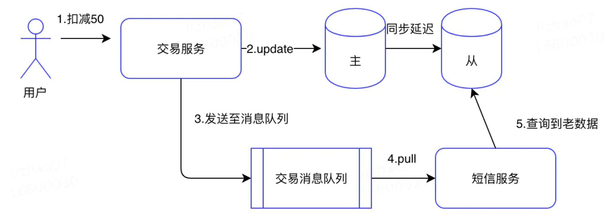

> 来源：每日一博 | 你知道数据一致性有几种吗？谈谈数据一致性《https://www.jianshu.com/p/f64d56d46911》

# 理论知识

## CAP

在[理论计算机科学](https://zh.wikipedia.org/wiki/理論計算機科學)中，**CAP定理**（CAP theorem），又被称作**布鲁尔定理**（Brewer's theorem），它指出对于一个[分布式计算系统](https://zh.wikipedia.org/wiki/分布式计算)来说，[不可能同时满足以下三点](https://zh.wikipedia.org/wiki/三难困境)：[[1\]](https://zh.wikipedia.org/wiki/CAP定理#cite_note-Lynch-1)[[2\]](https://zh.wikipedia.org/wiki/CAP定理#cite_note-2)

- 一致性（**C**onsistency） （等同于所有节点访问同一份最新的数据副本）
- [可用性](https://zh.wikipedia.org/wiki/可用性)（**A**vailability）（每次请求都能获取到非错的响应——但是不保证获取的数据为最新数据）
- [分区容错性](https://zh.wikipedia.org/w/index.php?title=网络分区&action=edit&redlink=1)（**P**artition tolerance）（以实际效果而言，分区相当于对通信的时限要求。系统如果不能在时限内达成数据一致性，就意味着发生了分区的情况，必须就当前操作在C和A之间做出选择[[3\]](https://zh.wikipedia.org/wiki/CAP定理#cite_note-3)。）

## ACID

**ACID**，是指[数据库管理系统](https://zh.wikipedia.org/wiki/数据库管理系统)（[DBMS](https://zh.wikipedia.org/wiki/DBMS)）在写入或更新资料的过程中，为保证[事务](https://zh.wikipedia.org/wiki/数据库事务)（transaction）是正确可靠的，所必须具备的四个特性：[原子性](https://zh.wikipedia.org/w/index.php?title=原子性&action=edit&redlink=1)（atomicity，或称不可分割性）、[一致性](https://zh.wikipedia.org/wiki/一致性_(数据库))（consistency）、[隔离性](https://zh.wikipedia.org/wiki/隔離性)（isolation，又称独立性）、[持久性](https://zh.wikipedia.org/wiki/持久性)（durability）。

# 数据一致性的分类

一般来说数据一致性我们可以分成三类，时间点一致性，事务一致性，应用一致性。

## 时间点一致性

如果所有相关的数据组件在任意时刻都是一致的，那么可以称作为时间点一致性。

简单来说，就是在任意时刻，所有分布式组件的数据，都是一模一样的，“本是分布式，结果完全一模一样”

当然CAP和时间点一致性并不是完全的一致:时间点一致性的定义中要求所有数据组件的数据在任意时刻都是完全一致的，但是一般来说信息传播的速度最大是光速，其实并不能达到任意时刻一致，总有一定的时间不一致，对于我们CAP中的一致性来说只要达到读取到最新数据即可，达到这种情况并不需要严格的任意时间一致。

## 事务一致性

ACID中的C，定义如下：

> 事务的一致性指的是在一个事务执行之前和执行之后数据库都必须处于一致性状态。如果事务成功地完成，那么系统中所有变化将正确地应用，系统处于有效状态。如果在事务中出现错误，那么系统中的所有变化将自动地回滚，系统返回到原始状态。

这里一般的初学者都会把CAP和ACID中的C都会误解成一样的含义，其实他们其中一个表示的数据的相同，而另一个是用来表示某种约束。

## 应用一致性

应用一致性可以看做是约束一致性中的一种。上面的事务一致性代表的是单一数据源，如果数据源是多个，比如数据源有多个数据库，文件系统，缓存等。那么就需要我们应用一致性，这里也看做是分布式事务一致性。

在应用程序中涉及多个不同的单机事务，只有在所有的单机事务完成之前和完成之后，数据是完全一致的。比如给用户发送券和积分，券服务和积分服务是两个服务，他们各自有自己单机事务，这两个单机单机事务开始前和完成后都能保证用户的帐是对应上的。但是在这两个单机事务执行过程有可能会出现只送了券，没有送积分的情况，有可能状态不正确。

# 一致性的模型

如果有人问你你知道哪些一致性模型呢？很多人马上答出，强一致，最终一致。其实一致性的模型远远不止这么点，在《[Operational Characterization of Weak Memory Consistency Models](https://es.cs.uni-kl.de/publications/datarsg/Senf13.pdf)》这篇论文当中描述了15种弱内存一致模型，而在维基百科对内存模型的描述还有更多。

很多一致性的模型最开始是用来描述内存是否一致的，也就是最开始并不是运用于分布式系统当中的。如果我们的机器是单核的话，那么他的内存一定是强一致的。如果我们的机器是多核的话，那么由于处理器并不是直接访问的内存而是访问的处理器独享的缓存，那么就有可能会出现不一致。再分布式中我们的每个节点其实就可以看成一个独立的处理器，而我们最初运用于内存一致性模型，也可以运用于我们分布式系统当中。下面我会从强到弱讲讲一些常见的一致性模型。

## 线性一致性

线性一致性又叫做原子一致性，强一致性。线性一致性可以看做只有一个单核处理器，或者可以看做只有一个数据副本，并且所有操作都是原子的。

在可线性化的分布式系统中，如果某个节点更新了数据，那么在其他节点都能读取到这个最新的数据。可以看见线性一致性和我们的CAP中的C是一致的。

举个非线性一致性的例子，比如有个秒杀活动，你和你的朋友同时去抢购一样东西，有可能他那里的库存已经没了，但是在你手机上显示还有几件，这个就违反了线性一致性，哪怕过了一会你的手机也显示库存没有，也依然是违反了。

线性一致性有什么作用呢？在《DDIA》这本书中描述了下面3个作用:

- 加锁与主节点选举:主从复制系统需要确保只有一个主节点，否则会产生脑裂。选举新的主节点一般是使用锁:每个启动的节点都需要获得锁。而这个锁就需要满足可线性化，让所有的节点都同时同意哪个节点有锁。我们的ZooKeeper就可以用来提供分布式锁功能，那么我们就可以说ZooKeeper是满足线性一致性的吗？这个只能说说对了一部分，后面再顺序一致性的时候会对ZK是什么一致性再次说明。
- 约束与唯一性保证:比如同一个文件目录下不允许有两个相同的文件名，数据库主键不能重复，这些都需要线性化。其实这些本质和加锁类似，比如相同的文件名，那其实就是对这个文件名去做一个加锁操作，然后去保存，后保存的自然会出错。
- 跨通道的时间依赖:之前的那个抢购的那个例子为什么会被违反呢？原因是因为我们通过朋友告知这个通道，让我们提前知道了这个货物已经卖完。同样的如果我们计算机中出现了多个通道。举个例子，在用户交易的场景下，用户使用了50元，那么会在其余额中扣减50元，这个时候把这个事件作为一个消息队列给发送出去，然后短信服务会查询用户的余额然后进行发送短信，如果余额数据库的从库这个时候还没有更新数据，那么这个短信就有可能会取到用户旧的余额。这里出现不一致的原因就是因为多了一个通道，就和我们上面朋友告知我们卖完的通道一样。解决这个办法可以控制某一个通道，比如说将这个用户的余额作为参数给传进去，或者只读主库。秒杀的那个例子中，你可以不要自己的手机，去用朋友的手机。

## 顺序一致性

**所谓的顺序一致性，**其实就是规定了一下两个条件：
**（1）每个线程内部的指令都是按照程序规定的顺序（program order）执行的（单个线程的视角）**
**（2）线程执行的交错顺序可以是任意的，但是所有线程所看见的整个程序的总体执行顺序都是一样的（整个程序的视角）**

顺序一致性弱于严格一致性。对变量的写操作不一定要在瞬间看到，但是，不同处理器对变量的写操作必须在所有处理器上以相同的顺序看到，这里处理器再分布式系统中可以换成不同的节点。

这里我们又再回到Zookeeper到底是什么一致性？有很多面试题都会问到Zookeeper是CP还是AP呢？很多人都会回答到Zookeeper是CP，其实这个回答并不是很严谨的，我们从线性一致性中知道CAP中的一致性指的是线性一致性，那我们就可以说Zookeeper是线性一致性的吗？答案是否定的。当我们写入一个值的时候，会交由Leader去处理，Zab协议只需要保证半数从节点成功即可，那么就会有节点的数据是老的数据，这样客户端就有可能读出的数据并非是最新的从而破坏了线性一致性。

Zookeeper其实实现的是顺序一致性，在ZK中利用zxid(ZooKeeper Transaction Id),实现了整体顺序一致性，当然也可以认为Zookeeper的的写是线性一致性，读是顺序一致性。从节点通过zxid顺序的接收leader的广播，所以ZK不能保证所有的信息马上看到，但是最终都会看到。当然Zookeeper其实可以实现线性化，在ZK中有一个sync()命令，只要我们每次读的时候都去调用sync()强制同步数据，那么我们都能保证其是最新的。

顺序一致性是由Lamport(Paxos算法的作者)提出的，最开始只用来定义多处理内存的一致性，在Lamport的《How to Make a Multiprocessor Computer That Correctly Executes Multiprocess Programs》中其定义了什么是顺序一致性:

> the result of any execution is the same as if the operations of all the processors were executed in some sequential order, and the operations of each individual processor appear in this sequence in the order specified by its program.

这句话的大致意思是多处理器的执行效果和单个处理器的执行效果是一样的,每个独立的处理器的操作都会按照指定的顺序出现在操作队列。这个最开始是用于并发编程的，但是让多处理器的执行变得和单处理器的确是没啥作用，后来就用于分布式系统当中。在ZK中所有的写操作都会交给Leader节点去做，并且所有操作的更新都会根据zxid的顺序进行更新，这里就是上面所说的指定的顺序，这个队列就是按照zxid的顺序。

## 因果一致性

因果一致性指的是：如果节点A在更新完某个数据后通知了节点B，那么节点B之后对该数据的访问和修改都是基于A更新后的值。于此同时，和节点A无因果关系的节点C的数据访问则没有这样的限制。

怎么理解因果关系呢？简单来说如果有人问你一个问题，那么你给出答案，这两个就是因果关系，但如果你给出答案再问题之前，那么这个就违反了因果关系。 举个简单的例子如果节点1更新了数据A，节点2读取数据A，并更新数据B，这里的数据B有可能是根据数据A计算出来的，所有具备因果关系，但是如果节点3看到的是先更新的B，再更新的A那么就破坏了因果一致性。

## 处理器一致性

处理器一致性是更加弱的一致性模型，他只需要保证处理器看到某个处理器或者多个不同处理对相同位置的写入都是一致的。不需要考虑因果关系，而是对同一个内存或者同一个数据更新需要看到一致的顺序。

## FIFO一致性

FIFO一致性是比处理器一致性还更加弱的一种，它不需要保证对相同位置的写入是一致的。 是指在一个处理器上完成的所有写操作，将会被以它实际发生的顺序通知给所有其它的处理器；但是在不同处理器上完成的写操作也许会被其它处理器以不同于实际执行的顺序所看到。这个在分布式系统中反映了网络中不同节点的延迟可能是不相同的。为了说明其和处理器一致性不同有如下例子:

上面这个图中，可以发现是违反了处理器一致性的，为什么呢因为写入顺序是w(x)1,w(x)2而，p4应该是先R(x)1再R(x)2。但是这个符合FIFO一致性，FIFO只需要把自己的发生顺序通知给其他的处理器或者节点，不需要保证同一个值写入顺序是一致的。

## 最终一致性

其实除了强一致以外，其他的一致性都可以看作为最终一致性，只是根据一致性不同模型的不同要求又衍生出了很多具体一致性模型。当然最简单的最终一致性，是不需要关注中间变化的顺序，只需要保证在某个时间点一致即可。只是这个某个时间点需要根据不同的系统，不同业务再去衡量。再最终一致性完成之前，有可能返回任何的值，不会对这些值做任何顺序保证。

> BASE理论中的E就是最终一致。

