## 协程简介

### 基本概念

#### 协程

> 在这里略过进程和线程的基本概念，默认读者了解

协程不是被操作系统内核所管理，而完全是由程序所控制（也就是在用户态执行）。这样带来的好处就是性能得到了很大的提升，不会像线程那样需要上下文切换来消耗资源（用户态和内核态的切换），因此**协程的开销远远小于线程的开销**。

- 协程本质上就是用户态线程，将调度的代码在用户态重新实现。因为子程序切换不是线程切换而是由程序自身控制，没有线程切换的开销，所以协程有极高的执行效率。协程通常是纯软件实现的多任务，与CPU和操作系统通常没有关系，跨平台，跨体系架构。
- 协程在执行过程中，可以调用别的协程自己则中途退出执行，之后又从调用别的协程的地方恢复执行。这有点像操作系统的线程，执行过程中可能被挂起，让位于别的线程执行，稍后又从挂起的地方恢复执行。
- 对于线程而言，其上下文存储在内核栈上。线程的上下文切换必须先进入内核态并切换上下文, 这就造成了调度开销。线程的结构体存在于内核中，在pthread_create时需要进入内核态，频繁创建开销大。

#### 协程的优点与缺点

优点：

- 跨平台体系结构
- 无需线程上下文切换的开销（相比线程切换）
- 无需原子操作锁定及同步的开销（相比多线程程序）
- 方便切换控制流，简化编程模型（调用与回调可以在同一个地方写完）
- 高并发+高扩展性+低成本：高性能CPU可以启用非常多的协程，很适合用于高并发处理。

缺点：

- ###### 无法利用多核资源：协程的本质是个单线程，它不能将一个**多核处理器**的的多个核同时用上,协程需要和进程配合才能运行在多CPU上。（线程、多核、超线程参见CSAPP第三版1.9.2并发和并行P17）当然我们日常所编写的绝大部分应用都没有这个必要，除非是cpu密集型应用。

- 进行阻塞（Blocking）操作（如IO时）会阻塞掉整个程序。（https://cloud.tencent.com/developer/article/1684951）

  |                    | 进程                                               | 线程                           | 协程                               |
  | ------------------ | -------------------------------------------------- | ------------------------------ | ---------------------------------- |
  | 切换者             | OS                                                 | OS                             | 用户                               |
  | 切换时机           | 根据操作系统自己定义的切换策略                     | 根据操作系统自己定义的切换策略 | 用户自己的程序决定                 |
  | 切换内容           | 页全局目录、内核栈、硬件上下文（进程空间相关知识） | 内核栈、硬件上下文             | 硬件上下文                         |
  | 切换内容的保存位置 | 保存在内核中                                       | 保存在内核中                   | 保存于用户自己定义的用户栈或者堆中 |
  | 切换过程           | 用户态-内核态-用户态                               | 用户态-内核态-用户态           | 用户态（无陷入内核态）             |
  | 切换效率           | 低                                                 | 中                             | 高                                 |

### 协程实现相关概念

#### 函数栈切换

Linux 使用虚拟地址空间，大大增加了进程的寻址空间，由低地址到高地址分别为：

- 只读段/代码段：只能读，不可写；可执行代码、字符串字面值、只读变量
- 数据段：已初始化且初值非0全局变量、静态变量的空间
- BSS(Block Started Symbol)段：未初始化或初值为0的全局变量和静态局部变量
- 堆 ：就是平时所说的动态内存， malloc/new 大部分都来源于此
- 文件映射区域 ：如动态库、共享内存等映射物理空间的内存，一般是 mmap 函数所分配的虚拟地址空间
- 栈：用于维护函数调用的上下文空间；局部变量、函数参数、返回地址等
- 内核虚拟空间：用户代码不可见的内存区域，由内核管理(页表就存放在内核虚拟空间)


##### 栈帧

栈帧是指为一个函数调用单独分配的那部分栈空间。比如，当运行中的程序调用另一个函数时，就要进入一个新的栈帧，原来函数的栈帧称为调用者函数的帧，新的栈帧称为被调用函数的帧（当前帧）。被调用的函数运行结束后当前帧全部回收，回到调用者的帧。

栈帧的详细结构如下图所示：

函数A调用函数B，A就是调用者函数，B就是被调用函数

（参考CSAPP 3.7 过程【3.7.1 运行时栈】P164）

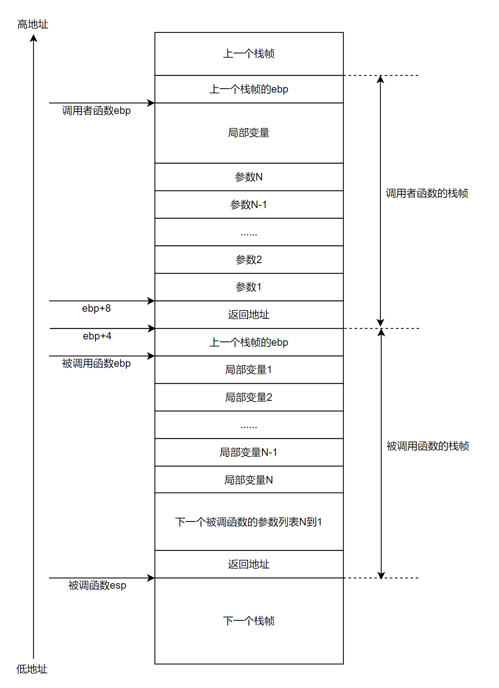

##### 函数调用时的esp/ebp

当进行函数调用的时候，除了将参数挨个入栈、将**返回地址（指明当B返回的时候，要从A程序的哪个位置(程序指令在内存中的地址)继续执行，参见程序计数器相关：https://www.zhihu.com/question/22609253）**入栈以外，接下来就是移动esp和ebp指针

```c++
void func A()
{
  int x = 1;
	B();
  int y = 2;	// 调用完函数，需要执行的下一条语句。该语句在程序运行时，最终变成机器可以执行的指令，该指令存储在内存中的位置就是返回地址。那么到底所谓的该指令长什么样子呢？那就是回到前面说的代码段（Code Segment）的地方，PC程序计数器中的内容就是一个地址，当前执行指令的地址（样子就是CS:IP，Code Segment:Instruction Pointer），代码段（CS）里面的内容是机器(指代处理器)都能通过使用指令集来看懂的指令，是二进制内容！
  return;
}

void func B()
{
  int z = 3;
  return;
}
```

参考资料：

**1、CS:IP是什么？**

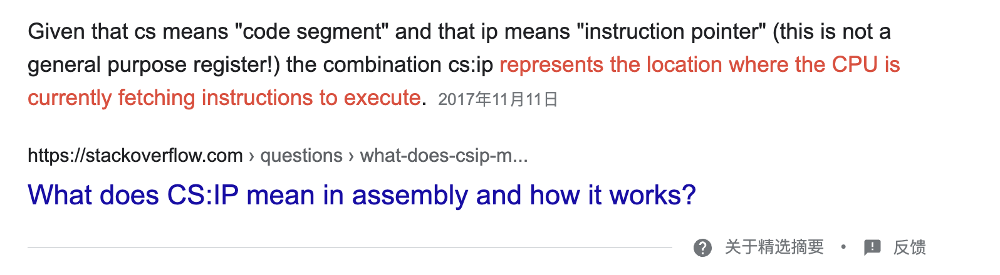

**2、程序计数器**

https://www.zhihu.com/question/22609253

**3、[What does the text segment in a program's memory refer to? ](https://stackoverflow.com/questions/27452946/what-does-the-text-segment-in-a-programs-memory-refer-to)**


将调用者(A)函数的ebp入栈(push ebp)，然后将调用者函数的栈顶指针ESP赋值给被调函数的EBP(作为被调函数的栈底,move ebp,esp)，之后便可以将局部变量push的方式入栈了，结果如下图所示：

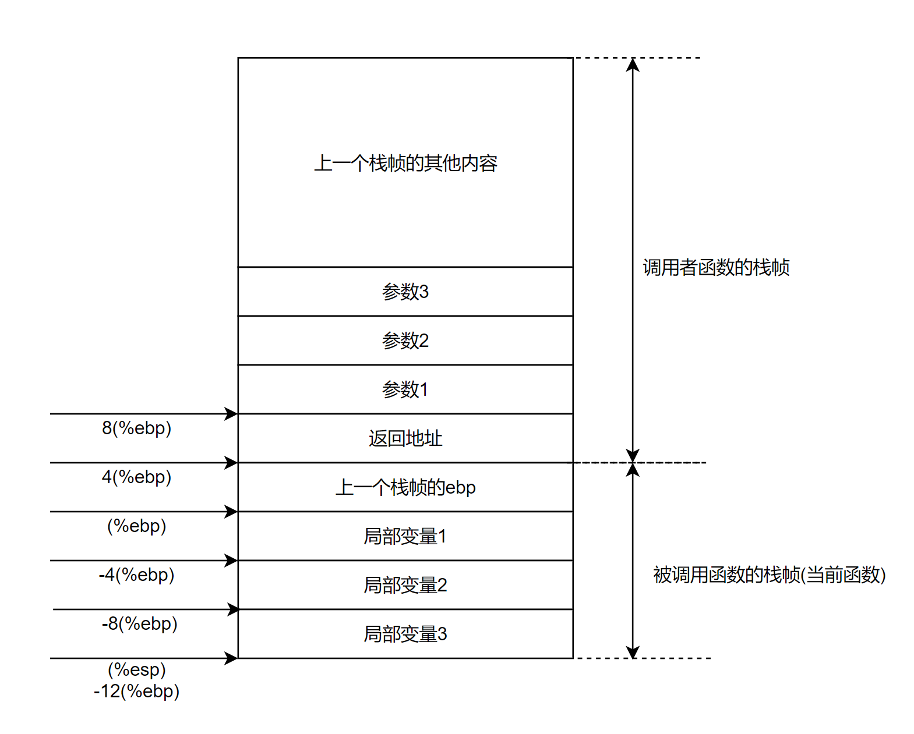

此时,EBP寄存器处于一个非常重要的位置,该寄存器中存放着一个地址(原EBP入栈后的栈顶),以该地址为基准,向上(栈底方向)能获取返回地址、参数值,向下(栈顶方向)能获取函数的局部变量值,而该地址处又存放着上一层函数调用时的EBP值;

一般规律,SS:[ebp+4]处为被调函数的返回地址,SS:[EBP+8]处为传递给被调函数的第一个参数(最后一个入栈的参数,此处假设其占用4字节内存)的值,SS:[EBP-4]处为被调函数中的第一个局部变量,SS:[EBP]处为上一层EBP值;由于EBP中的地址处总是"上一层函数调用时的EBP值",而在每一层函数调用中,都能通过当时的EBP值"向上(栈底方向)能获取返回地址、参数值,向下(栈顶方向)能获取被调函数的局部变量值";

如此递归，就形成了函数调用栈；


##### 函数调用栈

不管是较早的帧，还是调用者的帧，还是当前帧，它们的结构是完全一样的，因为每个帧都是基于一个函数，帧随着函数的生命周期产生、发展和消亡。这里用到了两个寄存器，`%ebp`是帧指针（帧寄存器），它总是指向当前帧的底部；`%esp`是栈指针（栈寄存器），它总是指向当前帧的顶部。这两个寄存器用来定位当前帧中的所有空间，在后面的代码中将会经常出现。**编译器需要根据IA32指令集的规则小心翼翼地调整这两个寄存器的值，一旦出错，参数传递、函数返回都可能出现问题。**

```c++
int caller()
{
    int arg1 = 534;
    int arg2 = 1057;
    int sum = swap_add(&arg1, &arg2);
    int diff = arg1 - arg2;
    return sum * diff;
}

int swap_add(int *xp, int *yp)
{
    int x = *xp;
    int y = *yp;
    *xp = y;
    *yp = x;
    return x + y;
} 
```

首先，程序从`caller`开始运行，为了详细说明每一行程序都做了什么操作，我们将`caller`函数的C代码编译成汇编码，并给每一句附上注释：

```assembly
1    caller:
2        pushl %ebp              # 将caller函数的上一层函数的ebp位置进行保存
3        movl %esp, %ebp         # 将这时候的esp位置设置为ebp位置（栈帧底部）
4        subl $24, %esp          # 分配 24 bytes 空间（后续介绍）
5        movl $534, -4(%ebp)     # 分配局部变量1为534
6        movl $1057, -8(%ebp)    # 分配局部变量2为1057
7        leal -8(%ebp), %eax     # 计算&arg2并放入%eax
8        movl %eax, 4(%esp)      # 将&arg2放入参数2位置(从右往左放入)
9        leal -4(%ebp), %eax     # 计算&arg1并放入%eax
10       movl %eax, (%esp)       # 将&arg1放入参数1位置(从右往左放入)
11       call swap_add           # 调用swap_add函数
12       ...
```

第3行执行完如下：

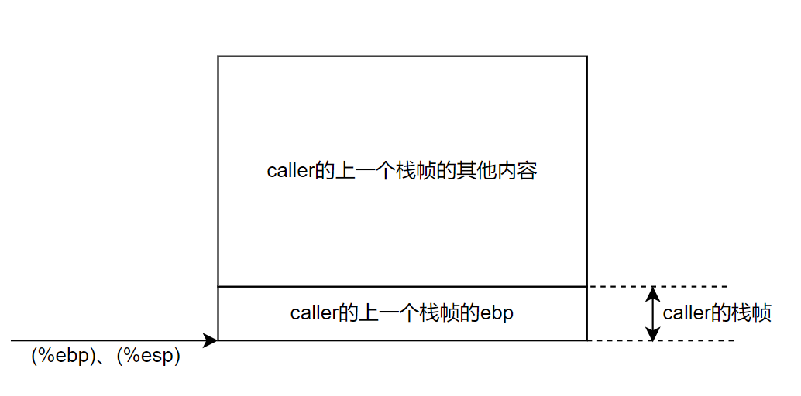

第10行执行完如下：

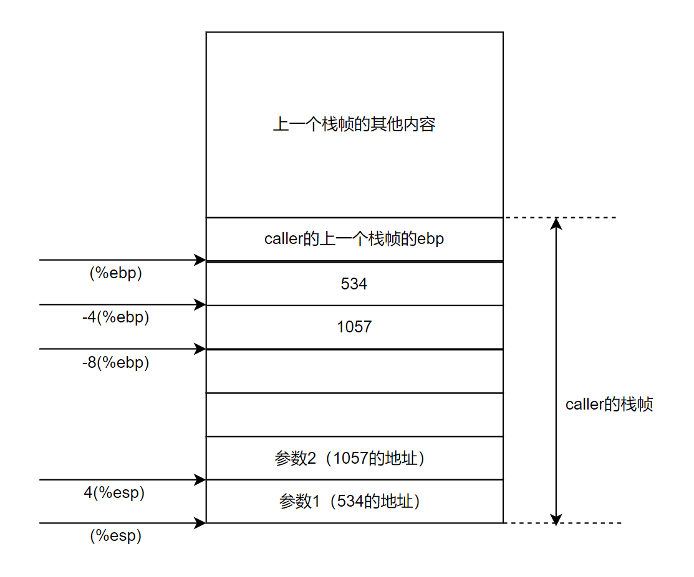

来解释栈帧为什么申请了24字节的空间。在现代处理器中，栈帧必须16字节对齐，就是说栈底和栈顶的地址必须是16的整数倍。至于为什么会有这样的要求，请查看文章[《联合、数据对齐和缓冲区溢出攻击》](https://www.jianshu.com/p/b20c8838b929)。现在，既然要求是16的整数倍，24字节肯定是不够的，仔细观察栈帧除了这额外申请的24字节空间外，还有最初压栈的`%ebp`寄存器占用4字节，以及调用子函数前保存的返回地址占用4字节，加起来正好32字节，实现了16字节对齐。如下图所示。

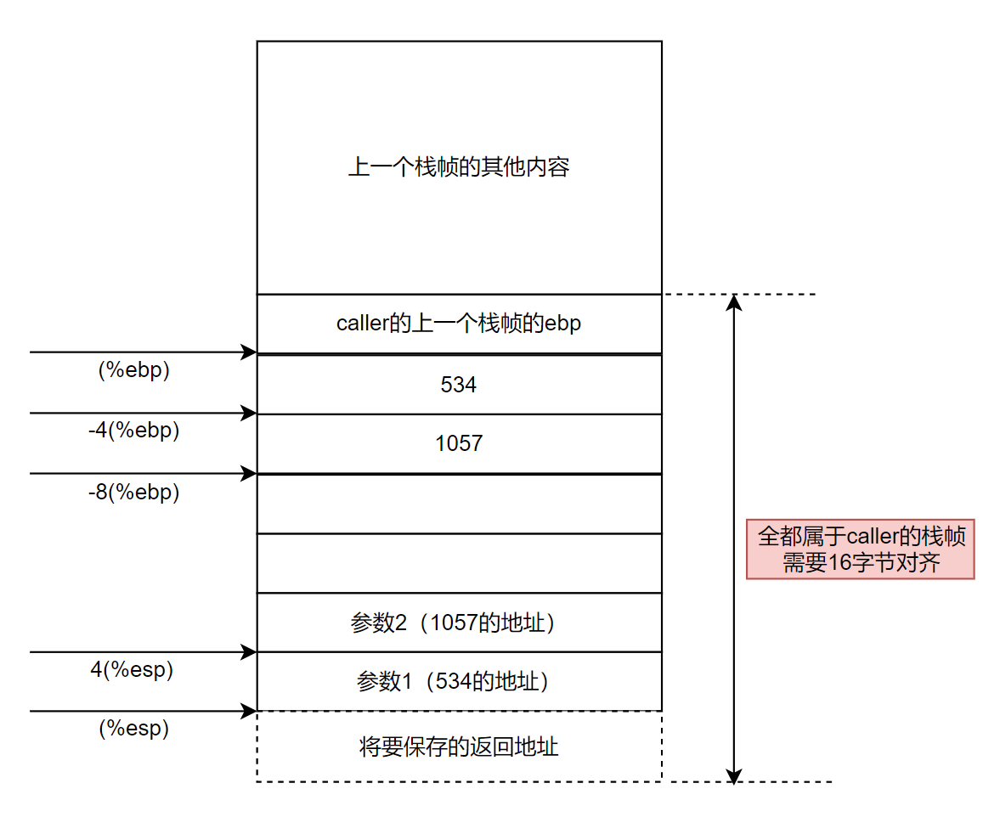

```assembly
1    caller:
2        pushl %ebp              # 将caller函数的上一层函数的ebp位置进行保存
3        movl %esp, %ebp         # 将这时候的esp位置设置为ebp位置（栈帧底部）
4        subl $24, %esp          # 分配 24 bytes 空间（后续介绍）
5        movl $534, -4(%ebp)     # 分配局部变量1为534
6        movl $1057, -8(%ebp)    # 分配局部变量2为1057
7        leal -8(%ebp), %eax     # 计算&arg2并放入%eax
8        movl %eax, 4(%esp)      # 将&arg2放入参数2位置(从右往左放入)
9        leal -4(%ebp), %eax     # 计算&arg1并放入%eax
10       movl %eax, (%esp)       # 将&arg1放入参数1位置(从右往左放入)
11       call swap_add           # 调用swap_add函数
12       ...
```

接下来执行第11行： call swap_add

`call`指令不仅仅是跳转到子函数的位置，而且还要为子函数的正确返回做准备。事实上，`call`指令可以分为两步，第一步将当前程序段的下一行代码的地址入栈，第二步才是跳转到子函数的代码段，相当于如下两行指令

```assembly
pushl [当执行结束返回到caller时，接下来需要执行的代码的地址]
jmp swap_add
```

在上面的代码中就是 int diff = arg1 - arg2; 这段代码的地址。

```c++
int swap_add(int *xp, int *yp)
{
    int x = *xp;
    int y = *yp;
    *xp = y;
    *yp = x;
    return x + y;
} 

int caller()
{
    int arg1 = 534;
    int arg2 = 1057;
    int sum = swap_add(&arg1, &arg2);
    int diff = arg1 - arg2;
    return sum * diff;
}
```

栈帧如下：

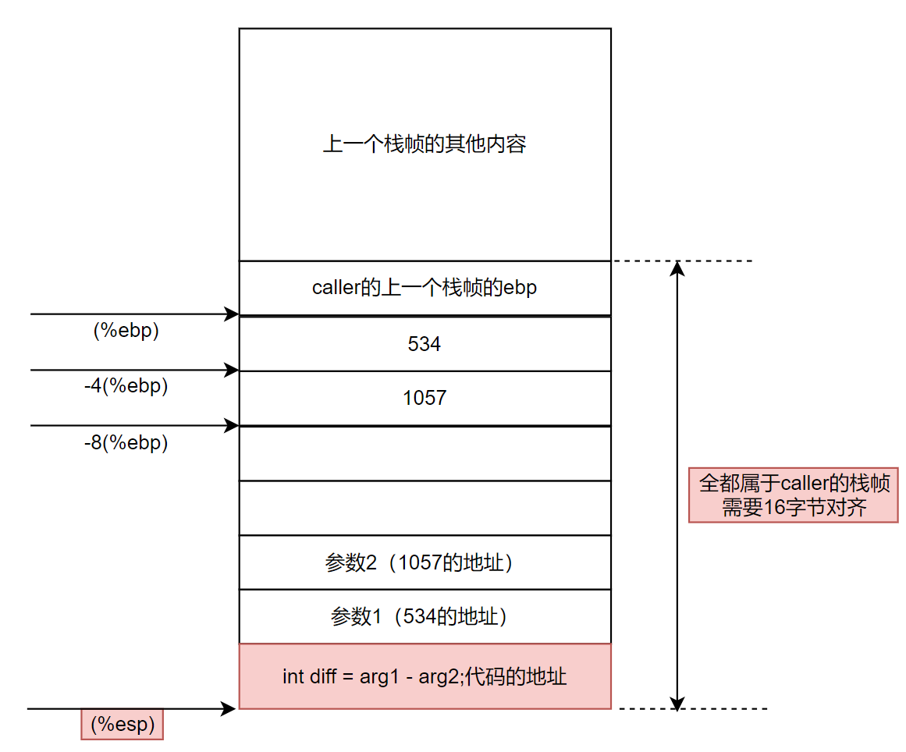

接下来看`swap_add`函数的汇编代码：也就是被调函数

```assembly
1    swap_add:
2        pushl %ebp              # 保存旧的%ebp，即caller的%ebp
3        movl %esp, %ebp         # 将这时的%esp设置为%ebp，也叫设置为swap_add函数的ebp
4        pushl %ebx              # 将%ebx入栈保存

5        movl 8(%ebp), %edx      #Get xp
6        movl 12(%ebp), %ecx     #Get yp
7        movl (%edx), %ebx       #Get x
8        movl (%ecx), %eax       #Get y
9        movl %eax, (%edx)       #Store y at xp
10       movl %ebx, (%ecx)       #Store x at yp
11       addl %ebx, %eax         #Return value = x+y

12       popl %ebx               #Restore %ebx
13       popl %ebp               #Restore %ebp
14       ret                     #Return
```

2-4行为预处理部分，和前面分析过的预处理相似，保存旧的帧指针，设置新的帧指针，但多了一步：将第4行的%ebx寄存器入栈。该操作是为了保存`%ebx`寄存器的值，以便在函数结束时恢复原值，即第12行的`popl %ebx`。

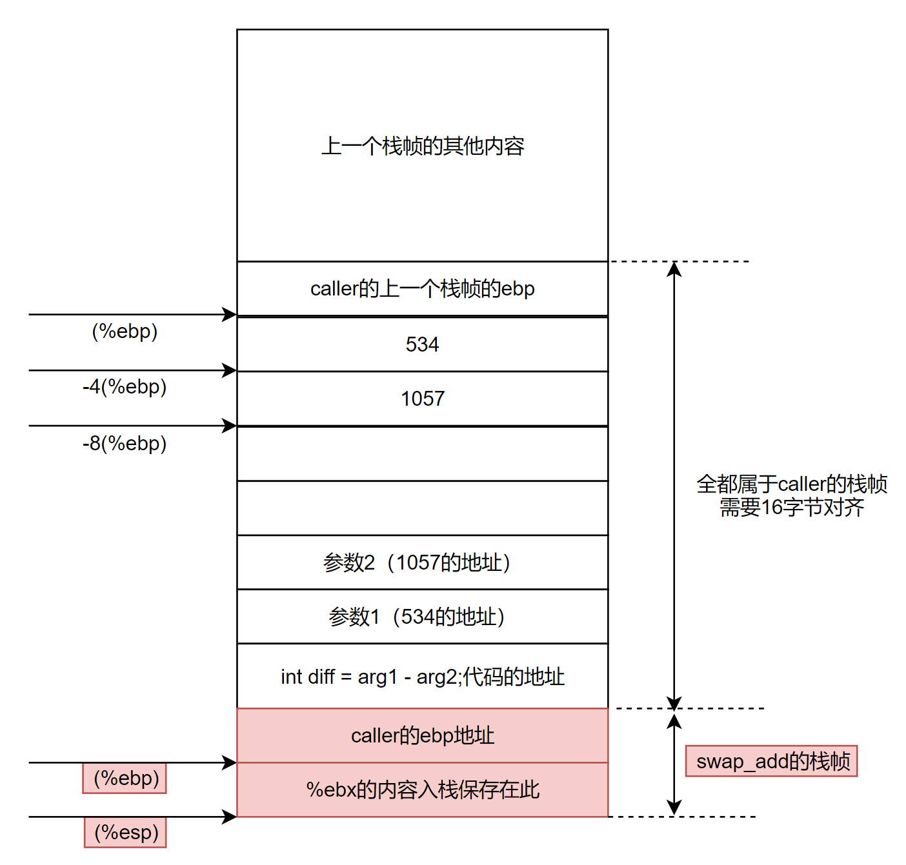

知识点：寄存器的使用惯例

为什么`caller`中没有保存`%ebx`而`swap_add`中却保存了呢？这涉及到IA32指令集的寄存器使用惯例，这个惯例保证了函数调用时寄存器的值不会丢失或紊乱。

> `%eax`、`%edx`和`%ecx`称为**调用者保存**寄存器，被调用者使用这三个寄存器时不必担心它们原来的值有没有保存下来，这是调用者自己应该负责的事情。
>
> `%ebx`、`%esi`和`%edi`称为**被调用者保存**寄存器，被调用者如果想要使用它们，必须在开始时保存它们的值并在结束时恢复它们的值，一般通过压栈和出栈来实现。

这就可以解释我们的疑问了。由于`%ebx`是被调用者保存寄存器，因此在`swap_add`中我们通过`pushl %ebx`和`popl %ebx`来保存该寄存器的值在函数执行前后不变。

```c++
int swap_add(int *xp, int *yp)
{
    int x = *xp;
    int y = *yp;
    *xp = y;
    *yp = x;
    return x + y;
}
```

```assembly
1    swap_add:
2        pushl %ebp              # 保存旧的%ebp，即caller的%ebp
3        movl %esp, %ebp         # 将这时的%esp设置为%ebp，也叫设置为swap_add函数的ebp
4        pushl %ebx              # 将%ebx入栈保存

5        movl 8(%ebp), %edx      #Get xp
6        movl 12(%ebp), %ecx     #Get yp
7        movl (%edx), %ebx       #Get x
8        movl (%ecx), %eax       #Get y
9        movl %eax, (%edx)       #Store y at xp
10       movl %ebx, (%ecx)       #Store x at yp
11       addl %ebx, %eax         #Return value = x+y

12       popl %ebx               #Restore %ebx
13       popl %ebp               #Restore %ebp
14       ret                     #Return
```

5~11行为`swap_add`函数的功能实现代码。略过不看，这里没有进行栈的push操作。

12~14行为结束代码，做一些函数的收尾工作。11行执行结束的函数栈帧如下：

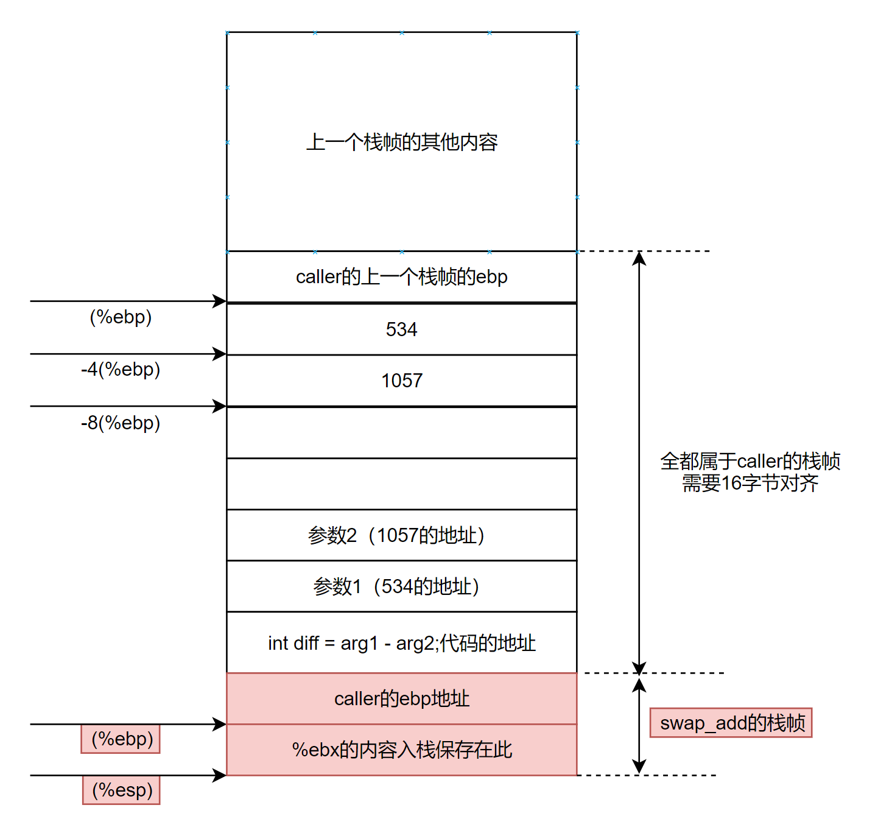

首先第12行恢复`%ebx`寄存器的值，接着第13行恢复`%ebp`寄存器的值，最后`ret`返回。而`ret`指令也分为两步，第一步取出当前栈顶的值（即int diff = arg1 - arg2;这段代码的地址），第二步将这个值作为跳转指令的地址跳转，相当于下面两行代码：

```assembly
popl %edx
jmp %edx
```

`ret`之后将会执行`call swap_add`指令紧跟着的下一行代码。

接下来给出`caller`函数剩下的汇编代码：（即call swap_add后的代码）

```assembly
11       call swap_add
12       movl -4(%ebp), %edx
13       subl -8(%ebp), %edx
14       imull %edx, %eax
15       leave
16       ret
```

12~14行都是在完成之后的一些运算而已，略过。但是15行用了一个没见过的指令`leave`，这又是什么意思呢？

我们来分析一下，这段代码和`swap_add`最后三行代码相比，少了两句`popl %ebx`和`popl %ebp`，多了一句`leave`。首先，`popl %ebx`不用考虑了，因为在`caller`的开头并没有`pushl %ebx`，因此也就没必要`popl %ebx`。那么我猜测`leave`是否替代了`popl %ebp`的功能呢？之所以这样猜测，首先我们得弄懂`popl %ebp`到底是什么功能。

很简单，**每个函数结束前需要将栈恢复到函数调用前的样子，其实就是恢复两个指针——帧指针和栈指针的位置**。`popl %ebp`的作用就是恢复帧指针的位置。而栈指针`%esp`呢？似乎没有看到哪条指令把它恢复。让我们再仔细捋一遍。先看子函数`swap_add`运行过程中的栈指针。使栈指针变化的只有四条语句，2、4行的`pushl`指令和12、13行的`popl`指令，而且两对指令对栈指针的影响正好对消，于是栈指针在函数结束时已经回到了最初的位置，因此根本不需要额外的调整。

再考虑`caller`函数，**与`swap_add`不同的地方在于第4行申请了24字节的栈空间**，即手动将`%esp`寄存器的值减去了24。这就导致函数结束时栈指针无法回到最初的位置，需要我们手动将它恢复，`leave`指令就是这个作用。该指令相当于下面两条指令的合成：

```assembly
movl %ebp, %esp   # 手动恢复栈顶指针位置
popl %ebp         # 恢复上一个函数的ebp的位置
```

#### 有栈协程

> 协程切换时主要保存的上下文环境就是指寄存器的内容、栈帧的内容。

##### 独立栈

独立栈指的是在所有协程运行的过程中，它们用的栈帧是自己的栈，这块栈的地址的内容不会让其他协程进行读写。

缺点：独立栈往往会更加的**浪费**内存。因为，我们需要为每一个协程预先分配一个栈空间，但是问题是协程不一定会用完这个栈空间，而那些多出来的栈空间就是被浪费掉了的。而且空间太小也会有爆栈的隐患。

优点：每次切换协程的时候，不需要对栈进行拷贝。（相比于共享栈）

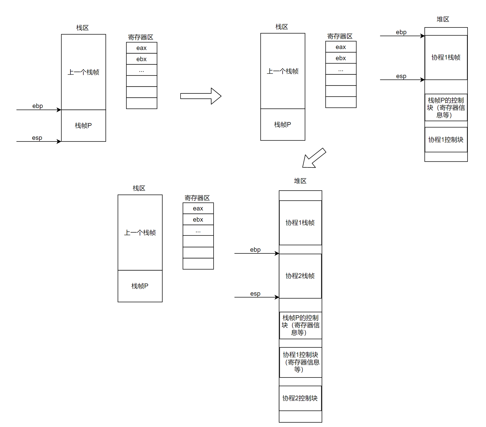

##### 共享栈

共享栈指的是在所有协程运行的过程中，它们用的任务栈是同一个栈。

优点：可以更加的节省内存。因为，我们只需要让协程使用这个共享的栈即可，然后，当协程挂起的时候，依据当前协程使用的栈空间大小来分配内存备份协程的栈内容。

缺点：就会使得每次换入和换出协程的时候，都要进行协程的栈数据的拷贝。

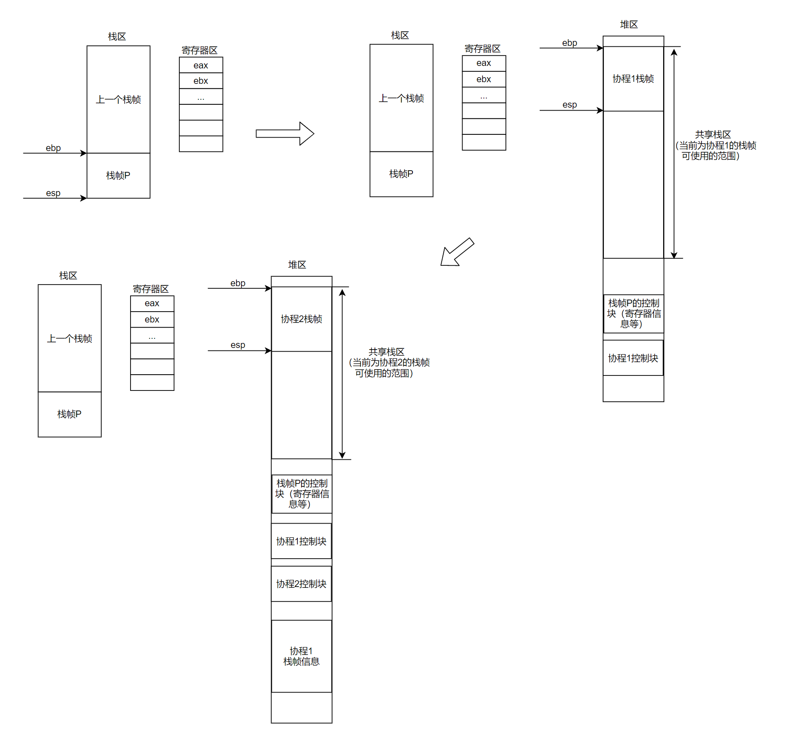

## 协程切换

libco使用：https://blog.csdn.net/arbboter/article/details/101375476

### 协程环境

数量对应关系来说，协程之于线程，相当于线程之于进程，一个进程可以包含多个线程，而一个线程中可以包含多个协程。以libco为例，线程中用于管理协程的结构体为`stCoRoutineEnv_t`（环境），它在该线程中第一个协程创建的时候进行初始化。
每个线程中都只有一个`stCoRoutineEnv_t`实例，线程可以通过该`stCoRoutineEnv_t`实例了解现在有哪些协程，哪个协程正在运行，以及下一个运行的协程是哪个。

简单来说，一个线程对应一个stCoRoutineEnv_t结构，一个stCoRoutineEnv_t结构对应多个协程。在第一次创建协程的时候会对stCoRoutineEnv_t进行初始化，并自动将当前线程执行的上下文空间为主协程，然后再创建真正的用户自己定义的协程。

```c++
struct stCoRoutineEnv_t
{
    stCoRoutine_t *pCallStack[ 128 ]; // 保存当前栈中的协程，上限128个
    int iCallStackSize;  // 表示当前在运行的协程的下一个位置，即cur_co_runtine_index + 1
    stCoEpoll_t *pEpoll; //用于协程时间片切换

    //for copy stack log lastco and nextco
    stCoRoutine_t* pending_co;
    stCoRoutine_t* occupy_co;
};
```

### 协程核心切换实现

首先是一个协程对应的它的上下文coctx_t的初始化如下：

```c++
int coctx_make( coctx_t *ctx,coctx_pfn_t pfn,const void *s,const void *s1 )
{
    //make room for coctx_param
    // 获取(栈顶 - param size)的指针，栈顶和sp指针之间用于保存函数参数
    char *sp = ctx->ss_sp + ctx->ss_size - sizeof(coctx_param_t);
    sp = (char*)((unsigned long)sp & -16L); // 用于16位对齐
 
    // 将参数填入到param中
    coctx_param_t* param = (coctx_param_t*)sp ;
    param->s1 = s;
    param->s2 = s1;

    memset(ctx->regs, 0, sizeof(ctx->regs));
    // 为什么要 - sizeof(void*)呢？ 用于保存返回地址
    ctx->regs[ kESP ] = (char*)(sp) - sizeof(void*);
    ctx->regs[ kEIP ] = (char*)pfn;

    return 0;
}
```

这段代码主要是做了什么呢？

1. 先给`coctx_pfn_t`函数预留2个参数的大小，并4位地址对齐
2. 将参数填入到预存的参数中
3. `regs[kEIP]`中保存了`pfn`的地址，`regs[kESP]`中则保存了栈顶指针 - 4个字节的大小的地址。这预留的4个字节用于保存`return address`。

现在我们来看下协程切换的核心 **coctx_swap**，这个函数是使用汇编实现的。主要分为保存当前栈空间上下文的寄存器，并写入即将到来的栈空间上下文的寄存器两个步骤。

先看一下执行汇编程序前的栈帧情况。`esp`寄存器指向`return address`。

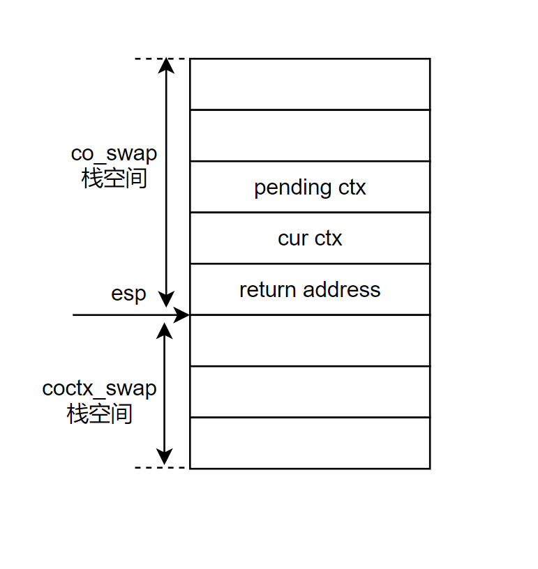

```assembly
//----- --------
// 32 bit
// | regs[0]: ret |
// | regs[1]: ebx |
// | regs[2]: ecx |
// | regs[3]: edx |
// | regs[4]: edi |
// | regs[5]: esi |
// | regs[6]: ebp |
// | regs[7]: eax |  = esp

coctx_swap:
1    leal 4(%esp), %eax // eax = esp + 4 保存co_swap栈空间的cur_ctx的地址到eax
2    movl 4(%esp), %esp  // esp = *(esp+4) = &cur_ctx 将cur_ctx这个地址赋值给esp。
3    leal 32(%esp), %esp // parm a : &regs[7] + sizeof(void*)  
                        // esp=&reg[7]+sizeof(void*) 移动esp的位置，为增加
                        // 为后续pushl的时候esp从高地址到低地址移动准备
4    pushl %eax // cur_ctx->regs[ESP] = %eax = returnAddress + 4 
5    pushl %ebp // cur_ctx->regs[EBX] = %ebp
6    pushl %esi // cur_ctx->regs[ESI] = %esi
7    pushl %edi // cur_ctx->regs[EDI] = %edi
8    pushl %edx // cur_ctx->regs[EDX] = %edx
9    pushl %ecx // cur_ctx->regs[ECX] = %ecx
10   pushl %ebx // cur_ctx->regs[EBX] = %ebx
11   pushl -4(%eax) // cur_ctx->regs[EIP] = return address 保存return address
```

1、其中的cur_ctx是一个堆的地址，里面的内容如下：

```c++
// 栈切换的时候需要保存的寄存器空间
struct coctx_t
{
#if defined(__i386__)
    void *regs[ 8 ];
#else
    void *regs[ 14 ];
#endif
    size_t ss_size;
    char *ss_sp;    
};
```

2、执行完第2句后，如下：

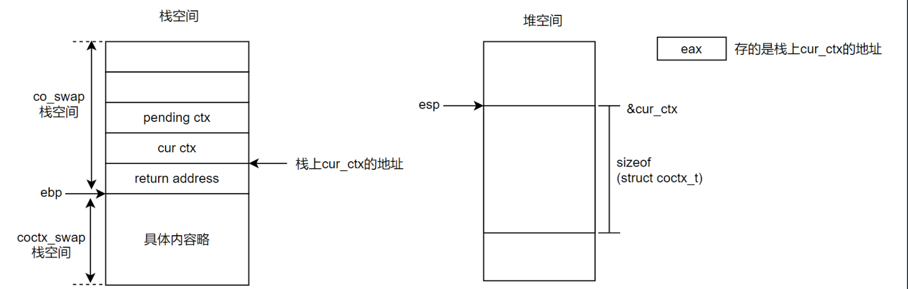

3、执行完第3句后，如下：

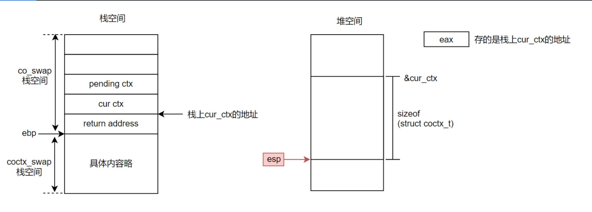

4、然后就是pushl的过程，通过该指令，esp向上移动，挨个保存寄存器内容。


下面是恢复`pend_ctx`中的寄存器信息到`cpu`寄存器中

```assembly
    movl 4(%eax), %esp //parm b -> &regs[0]
                       // esp=&pend_ctx 同样的，将pending_ctx的esp弄过去
    popl %eax  //%eax= pend_ctx->regs[EIP] = pfunc_t地址，通过popl就是反向的操作
    		  // popl本身就是低地址到高地址，所以不需要提前移动esp的位置
    popl %ebx  //%ebx = pend_ctx->regs[EBX]
    popl %ecx  //%ecx = pend_ctx->regs[ECX]
    popl %edx  //%edx = pend_ctx->regs[EDX]
    popl %edi  //%edi = pend_ctx->regs[EDI]
    popl %esi  //%esi = pend_ctx->regs[ESI]
    popl %ebp  //%ebp = pend_ctx->regs[EBP]
    popl %esp  //%ebp = pend_ctx->regs[ESP] 即 (char*) sp - sizeof(void*)
    pushl %eax //set ret func addr
               // return address = %eax = pfunc_t地址
    xorl %eax, %eax
    ret // popl %eip 即跳转到pfunc_t地址执行
```

### 汇编栈帧切换时的注意事项

libco里面的swap函数里面大量用到push(pushl)和pop指令（如下所示），然而在一些其他的协程库里面的swap函数却使用大量的mov指令而非push/pop指令，为什么？

```assembly
coctx_swap:
1    leal 4(%esp), %eax // eax = esp + 4 保存co_swap栈空间的cur_ctx的地址到eax
2    movl 4(%esp), %esp  // esp = *(esp+4) = &cur_ctx 将cur_ctx这个地址赋值给esp。
3    leal 32(%esp), %esp // parm a : &regs[7] + sizeof(void*)  
                        // esp=&reg[7]+sizeof(void*) 移动esp的位置，为增加
                        // 为后续pushl的时候esp从高地址到低地址移动准备
4    pushl %eax // cur_ctx->regs[ESP] = %eax = returnAddress + 4 
5    pushl %ebp // cur_ctx->regs[EBX] = %ebp
6    pushl %esi // cur_ctx->regs[ESI] = %esi
7    pushl %edi // cur_ctx->regs[EDI] = %edi
8    pushl %edx // cur_ctx->regs[EDX] = %edx
9    pushl %ecx // cur_ctx->regs[ECX] = %ecx
10   pushl %ebx // cur_ctx->regs[EBX] = %ebx
11   pushl -4(%eax) // cur_ctx->regs[EIP] = return address 保存return address
```

原因：栈指针的使用方式违反Sys V ABI约定

注：应用程序二进制接口（Application Binary Interface，ABI）

> The end of the input argument area shall be aligned on a 16 (32 or 64, if __m256 or __m512 is passed on stack) byte boundary. In other words, the value (%esp + 4) is always a multiple of 16 (32 or 64) when control is transferred to the function entry point. **The stack pointer, %esp, always points to the end of the latest allocated stack frame.**
>
> — Intel386-psABI-1.1:2.2.2 The Stack Frame

> **The stack pointer, %rsp, always points to the end of the latest allocated stack frame.**
>
> — Sys V ABI AMD64 Version 1.0:3.2.2 The Stack Frame

不管是i386还是sys V的ABI都提到了The stack pointer, %rsp, always points to the end of the latest allocated stack frame.

即用户空间程序的栈指针必须时刻指到运行栈的[栈顶](https://zh.wikipedia.org/wiki/堆栈#操作)，而[coctx_swap.S](https://github.com/Tencent/libco/blob/v1.0/coctx_swap.S#L27)中却使用栈指针直接对位于堆中的数据结构进行寻址内存操作，这违反了ABI约定。

而在Linux信号处理手册中可以看到：

> **By default, the signal handler is invoked on the normal process stack.** It is possible to arrange that the signal handler uses an alternate stack; see sigalstack(2) for a discussion of how to do this and when it might be useful.
>
> — man 7 signal : Signal dispositions

也就是说，用pop方式实现的汇编代码，在有一个时刻出现了esp并不在栈顶的情况，要理解这一点，必须把ebp和esp绑定起来看，即esp在下图所示的时刻和ebp变得“毫无对应关系”，这会导致严重的后果。比如说此时用户态收到信号进入内核态，如果信号处理的时候使用了该esp指针，然而该esp指针的push操作仅仅只能维持sizeof(struct coctx_t)大小，显然很可能会出现问题，因为在正常情况下，esp的push时所在的栈空间都是远大于sizeof(struct coctx_t)的（即使使用共享栈的情况下）。

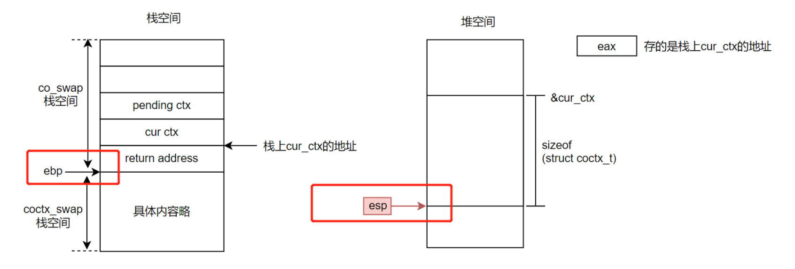

当然查了相关资料后了解到libco内部版本早已解决了这个问题，只是在开源版本里面仍然保留了这个bug。

## 协程上层管理

**了解了协程的实现原理之后，上层管理可以自己选择自己喜欢的方式，除了直接选择使用共享栈和独立栈的方式以外，甚至可以通过判断栈空间的大小来比较灵活地自动选择模式，以及进行一些具体业务强相关的协程库优化，从而得以让性能提高。**

### 协程模块数据结构

协程控制块stCoRoutine_t

```c++
struct stCoRoutine_t
{
    stCoRoutineEnv_t *env; // 即协程执行的环境，libco协程一旦创建便跟对应线程绑定了，不支持在不同线程间迁移，这里env即同属于一个线程所有协程的执行环境，包括了当前运行协程、嵌套调用的协程栈，和一个epoll的封装结构。这个结构是跟运行的线程绑定了的，运行在同一个线程上的各协程是共享该结构的，是个全局性的资源。
    pfn_co_routine_t pfn; // 实际等待执行的协程函数
    void *arg; // 上面协程函数的参数
    coctx_t ctx; // 上下文，即ESP、EBP、EIP和其他通用寄存器的值

    // 一些状态和标志变量
    char cStart;
    char cEnd;
    char cIsMain;
    char cEnableSysHook;
    char cIsShareStack;

    void *pvEnv; // 保存程序系统环境变量的指针

    //char sRunStack[ 1024 * 128 ];
    stStackMem_t* stack_mem; // 协程运行时的栈内存，这个栈内存是固定的 128KB 的大小。


    //save stack buffer while confilct on same stack_buffer;
    // 共享栈模式中使用
    char* stack_sp; 
    unsigned int save_size;
    char* save_buffer;

    stCoSpec_t aSpec[1024];
};
```

```c++
// 已经介绍过，略
struct stCoRoutineEnv_t
{
    stCoRoutine_t *pCallStack[ 128 ];
    int iCallStackSize;
    stCoEpoll_t *pEpoll;

    //for copy stack log lastco and nextco
    stCoRoutine_t* pending_co;
    stCoRoutine_t* occupy_co;
};
```

```c++
// 栈切换的时候需要保存的寄存器空间
struct coctx_t
{
#if defined(__i386__)
    void *regs[ 8 ];
#else
    void *regs[ 14 ];
#endif
    size_t ss_size;
    char *ss_sp;    
};
```

- stack_sp、save_size、save_buffer：这里要提到实现 stackful 协程（与之相对的还有一种stackless协程）的两种技术：Separate coroutine stacks 和 Copying the stack（又叫共享栈）。这三个变量就是用来实现这两种技术的。

  - 实现细节上，前者为每一个协程分配一个单独的、固定大小的栈；而后者则仅为正在运行的协程分配栈内存，当协程被调度切换出去时，就把它实际占用的栈内存 copy 保存到一个单独分配的缓冲区；当被切出去的协程再次调度执行时，再一次 copy 将原来保存的栈内存恢复到那个共享的、固定大小的栈内存空间。
  - 如果是独享栈模式，分配在堆中的一块作为当前协程栈帧的内存 stack_mem，这块内存的默认大小为 128K。
  - 如果是共享栈模式，协程切换的时候，用来拷贝存储当前共享栈内容的 save_buffer，长度为实际的共享栈使用长度。
  - 通常情况下，一个协程实际占用的（从 esp 到栈底）栈空间，相比预分配的这个栈大小（比如 libco 的 128KB）会小得多；这样一来， copying stack 的实现方案所占用的内存便会少很多。当然，协程切换时拷贝内存的开销有些场景下也是很大的。因此两种方案各有利弊，而 libco 则同时实现了两种方案，默认使用前者，也允许用户在创建协程时指定使用共享栈。


### 创建协程(create)

```c++
int co_create( stCoRoutine_t **ppco,const stCoRoutineAttr_t *attr,pfn_co_routine_t pfn,void *arg )
{
    if( !co_get_curr_thread_env() ) 
    {
        co_init_curr_thread_env();
    }
    stCoRoutine_t *co = co_create_env( co_get_curr_thread_env(), attr, pfn,arg );
    *ppco = co;
    return 0;
}
```

调用 co_create 将协程创建出来后，这时候它还没有启动，也即是说我们传递的 routine 函数还没有被调用。实质上，这个函数内部仅仅是分配并初始化 stCoRoutine_t 结构体、设置任务函数指针、分配一段“栈”内存，以及分配和初始化 coctx_t。

- ppco：输出参数，co_create内部为新协程分配一个协程控制块，ppco将指向这个分配的协程控制块。
- attr：指定要创建协程的属性（栈大小、指向共享栈的指针（使用共享栈模式））
- pfn：协程的任务（业务逻辑）函数
- arg：传递给任务函数的参数

### 启动协程(resume)

```c++
void co_resume( stCoRoutine_t *co )
{
    stCoRoutineEnv_t *env = co->env;
    stCoRoutine_t *lpCurrRoutine = env->pCallStack[ env->iCallStackSize - 1 ];
    if( !co->cStart )
    {
        coctx_make( &co->ctx,(coctx_pfn_t)CoRoutineFunc,co,0 );
        co->cStart = 1;
    }
    env->pCallStack[ env->iCallStackSize++ ] = co;
    co_swap( lpCurrRoutine, co );
}	
```

在调用 co_create 创建协程返回成功后，便可以调用 co_resume 函数将它启动了。

- 取当前协程控制块指针，将待启动的协程压入pCallStack栈，然后co_swap切换到指向的新协程上取执行，co_swap不会就此返回，而是要等当前执行的协程主动让出cpu时才会让新的协程切换上下文来执行自己的内容。

### 挂起协程(yield)

```c++
void co_yield_env( stCoRoutineEnv_t *env )
{
    stCoRoutine_t *last = env->pCallStack[ env->iCallStackSize - 2 ];
    stCoRoutine_t *curr = env->pCallStack[ env->iCallStackSize - 1 ];
    env->iCallStackSize--;
    co_swap( curr, last);
}
```

- 在非对称协程理论，yield 与 resume 是个相对的操作。A 协程 resume 启动了 B 协程，那么只有当 B 协程执行 yield 操作时才会返回到 A 协程。在上一节剖析协程启动函数 co_resume() 时，也提到了该函数内部 co_swap() 会执行被调协程的代码。只有被调协程 yield 让出 CPU，调用者协程的 co_swap() 函数才能返回到原点，即返回到原来 co_resume() 内的位置。
- 在被调协程要让出 CPU 时，会将它的 stCoRoutine_t 从 pCallStack 弹出，“栈指针” iCallStackSize 减 1，然后 co_swap() 切换 CPU 上下文到原来被挂起的调用者协程恢复执行。这里“被挂起的调用者协程”，即是调用者 co_resume() 中切换 CPU 上下文被挂起的那个协程。
- 同一个线程上所有协程是共享一个 stCoRoutineEnv_t 结构的，因此任意协程的 co->env 指向的结构都相同。

### 切换协程(switch)

- 上面的启动协程和挂起协程都设计协程的切换，本质是上下文的切换，发生在co_swap()中。
  - 如果是独享栈模式：将当前协程的上下文存好，读取下一协程的上下文。
  - 如果是共享栈模式：libco对共享栈做了个优化，可以申请多个共享栈循环使用，当目标协程所记录的共享栈没有被其它协程占用的时候，整个切换过程和独享栈模式一致。否则就是：将协程的栈空间内容从共享栈拷贝到自己的save_buffer中，将下一协程的save_buffer中的栈内容拷贝到共享栈中，将当前协程的上下文存好，读取下一协程上下文。
- 协程的本质是，使用ContextSwap，来代替汇编中函数call调用，在保存寄存器上下文后，把需要执行的协程入口push到栈上。

```c++
void co_swap(stCoRoutine_t* curr, stCoRoutine_t* pending_co)
{
    stCoRoutineEnv_t* env = co_get_curr_thread_env();

    //get curr stack sp
    // 略
}
```

这里起寄存器拷贝切换作用的coctx_swap函数，是用汇编来实现的。

- coctx_swap接受两个参数，第一个是当前协程的coctx_t指针，第二个参数是待切入的协程的coctx_t指针。该函数调用前还处于第一个协程的环境，调用之后就变成另一个协程的环境了。

```c++
extern "C"
{
    extern void coctx_swap( coctx_t *,coctx_t* ) asm("coctx_swap");
};
```

coctx_swap不再介绍

### 协程的事件管理

https://segmentfault.com/a/1190000012834756

https://segmentfault.com/a/1190000012656741

### hook系统

**libco库通过仅有的几个函数接口 co_create/co_resume/co_yield 再配合 co_poll，可以支持同步或者异步的写法，如线程库一样轻松。同时库里面提供了socket族函数的hook，使得后台逻辑服务几乎不用修改逻辑代码就可以完成异步化改造。**

#### 静态链接

在linux系统中，使用以下命令将源代码编译成可执行文件，源代码经过 预处理，编译，汇编，链接的过程最终生成可执行文件。一个简单的编译命令如下：

```shell
gcc -o hello hello.c main.c -lcolib
```

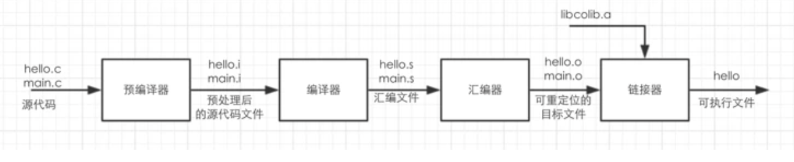

使用静态库有许多的缺点：

1. 可执行文件大小过大，造成硬盘的浪费
2. 如果库文件有更新，则依赖该库文件的可执行文件必须重新编译后，才能应用该更新
3. 假设有多个可执行文件都依赖于该库文件，那么每个可执行文件的`.code`段都会包含相同的机器码，造成内存的浪费

#### 动态链接

为了解决静态链接的缺点，就出现了动态链接的概念。动态库这个大家都不会陌生，比如`Windows`的`dll`文件，`Linux`的`so`文件。动态库加载后在系统中只会存有一份，所有依赖它的可执行文件都会共享动态库的`code`段，`data`段私有。
动态链接的命令如下：

```SHELL
gcc -o main main.o -L${libcolib.so path} -lcolib
```

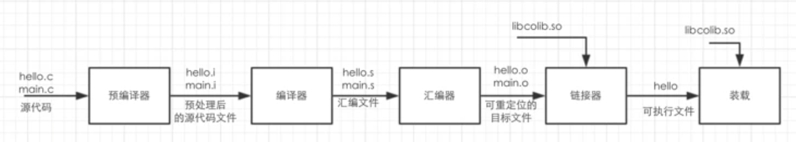

#### 运行时的动态链接

系统为我们提供了dlsym、dlopen等函数，用于运行时加载动态库。可执行文件在运行时可以加载不同的动态库，这就为hook系统函数提供了基础。

https://man7.org/linux/man-pages/man3/dlsym.3.html

dlopen以指定模式打开指定的动态连接库文件，并返回一个句柄给调用进程，dlsym通过句柄和连接符名称获取函数名或者变量名。具体做法在这里就不介绍了。

## 参考资料

https://juejin.cn/post/6961414532715511839

https://github.com/chenyahui/AnnotatedCode/blob/master/coroutine/coroutine.c

https://www.changliu.me/post/libco-coroutine/

https://zhuanlan.zhihu.com/p/94018082

https://www.cyhone.com/articles/analysis-of-libco/

https://segmentfault.com/a/1190000012834756

https://runzhiwang.github.io/2019/06/21/libco/

https://www.zhihu.com/question/52193579

https://github.com/Tencent/libco/issues/90